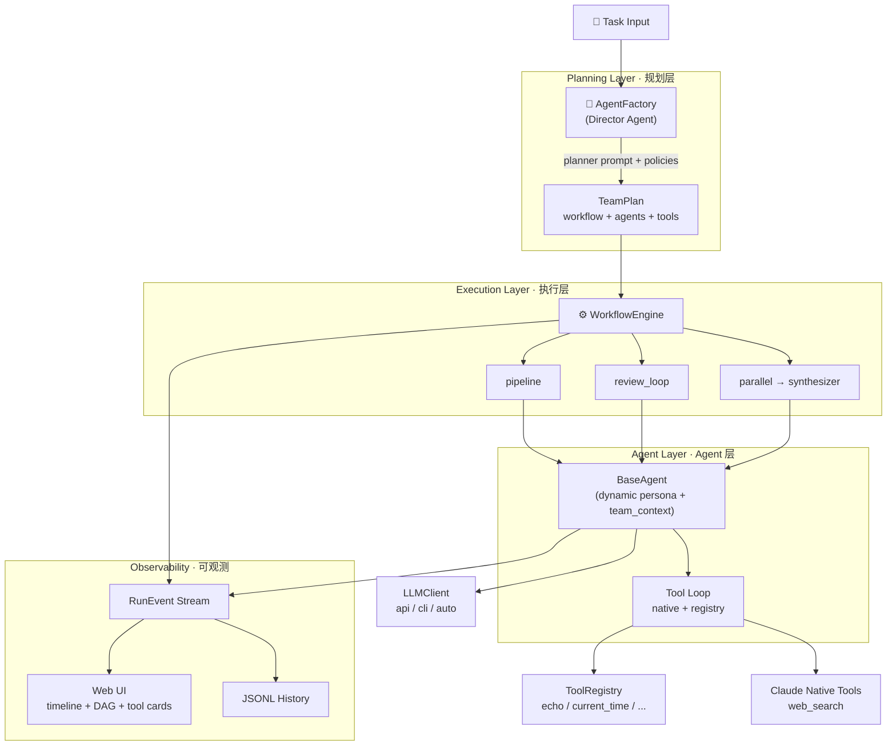

# 万象 · Wanxiang

> **AI-native multi-agent orchestration engine** — a Director dynamically plans agent teams for any task, across three workflow modes, with dual LLM backends and real-time observability.
>
> **AI 原生的多 Agent 编排引擎** —— Director 动态规划团队执行任意任务，支持三种编排模式、双 LLM 通道与实时可观测 UI。

[]()
[]()
[]()

🌐 [English](#english) | [中文](#中文)

---

## Architecture



---

## English

### Overview

**Wanxiang** (万象 — "ten thousand phenomena") is a multi-agent orchestration engine built around three core ideas:

1. **AI-native Message protocol** — agents communicate via structured messages (`intent` / `content` / `status` / `context` / `turn` / `metadata`) that LLMs can both produce and consume. No hardcoded schemas per agent.
2. **Dynamic Agent generation** — no predefined `WriterAgent` / `ReviewerAgent` subclasses. A `Director` agent reads the task and produces a `TeamPlan` at runtime: who the agents are, what their duties are, which tools they can use.
3. **Tool-aware collaboration** — every agent receives a `team_context` snapshot showing its peers' tool capabilities. Reviewers adjust their evaluation criteria based on whether the writer has live web search, which prevents unreasonable feedback in CLI-only environments.

### Features

- **Three workflow modes**: `pipeline` (sequential handoff), `review_loop` (producer + reviewer with convergence), `parallel` (concurrent researchers + synthesizer)
- **Dual LLM backend**: Anthropic Messages API (native tool use) or Claude Code CLI (stdin/stdout with JSON tool protocol). `auto` mode detects what's available and picks one.
- **Tool system**: Local `ToolRegistry` (with allowlist, timeout, schema validation) + Claude native server-side tools (e.g., `web_search`) + external MCP servers via stdio JSON-RPC 2.0 (filesystem, memory, any [Model Context Protocol](https://modelcontextprotocol.io) server), auto-registered into the registry with per-server `allowed_agents` ACL
- **Real-time UI**: WebSocket event stream, DAG visualization with live state, tool-call sub-step cards, duration analysis, draft diff, reviewer feedback aggregation, trace replay, run history
- **Graceful degradation**: In CLI mode, native tools are auto-stripped with a warning; agents fall back to plain LLM calls rather than crashing
- **MCP status probe**: Built-in endpoint checks `claude auth status` + `claude mcp list` and surfaces the result to the UI
- **Runtime tool synthesis**: When Director encounters a task needing a capability no existing tool provides, it can request a new tool via `needs_synthesis`. The `SkillForge` spins up a `SynthesizerAgent` → pytest-gated `SandboxExecutor` → on-pass `ToolRegistry.register` loop (with feedback-driven retry). The new tool is instantly available to downstream agents in the same run. Feature-flagged via `WANXIANG_ENABLE_SKILL_FORGE=1`.
- **Tool safety**: JSON Schema Draft 7 argument validation, UTF-8-safe output truncation (50 KB cap), ring-buffered call audit log (`GET /api/tools/audit`)
- **Offline trace mining**: `wanxiang.core.trace_mining.mine_traces()` aggregates `runs.jsonl` + tool audit log + synthesis log into a structured `TraceMiningReport` (final-status distribution, workflow mix, keyword-clustered failure patterns, per-tool usage grouped into builtin/native/mcp/synthesized, synthesis success rate, reviewer-convergence buckets, slowest agents, producer naming distribution). Exposed via `GET /api/trace/mining` with optional `?after=` / `?before=` ISO-8601 window filters. Pure static analysis — no LLM calls.
- **Immutable core protection**: Five files that define Wanxiang's safety boundaries (Message protocol, BaseAgent.execute + allowlist, WorkflowEngine three modes, ToolRegistry.execute safety pipeline, SandboxExecutor env isolation) are guarded by a pre-commit hook (`.githooks/pre-commit`) and 28 `inspect.signature` lock tests. Changes require `ALLOW_CORE_CHANGE=1` and manifest update. See `IMMUTABLE_CORE.md`.
- **Tool trust tier**: Four-level confidence grading (0=sandbox-passed, 1=first-real-SUCCESS, 2=multi-run-verified, 3=trusted-dependency) with sliding-window demotion (default: ≥3 failures in last 10 calls drops one level). Tiers go down as easily as they go up — failure signals take priority over success. All thresholds configurable.

### Quick Start

```bash
# 1. Clone
git clone https://github.com/yeyanle6/wanxiang.git
cd wanxiang

# 2. Install dependencies (with dev extras for pytest)
pip install -e ".[dev]"

# 3. Choose an LLM backend (one of)
export ANTHROPIC_API_KEY=sk-ant-...          # API mode (full feature set)
# OR
claude auth login                              # CLI mode (no native tools)

# 4a. Run a one-shot task from the CLI
wanxiang -y "Write a 500-word blog post on multi-agent systems"

# 4b. Or launch the web UI
wanxiang-server --port 8000
# Open http://127.0.0.1:8000
```

Optional mode overrides:

```bash
wanxiang --llm-mode cli "your task"
WANXIANG_LLM_MODE=api wanxiang-server --port 8000
```

### Workflows

| Mode | When to use | Execution |
|---|---|---|
| `pipeline` | Sequential stages that transform data step by step | `agent_1 → agent_2 → ... → agent_n`, terminates on error |
| `review_loop` | Content that benefits from iterative critique | `writer → reviewer` repeats up to `max_iterations` until reviewer returns SUCCESS |
| `parallel` | Multi-perspective research, independent branches | `researcher_a ∥ researcher_b ∥ ...` run concurrently, then `synthesizer` merges outputs |

The `Director` picks the workflow. Policy layer enforces guardrails (e.g., content tasks always include a reviewer; parallel mode always has a synthesizer as the last step).

### Tool System

Two classes of tools flow through the same event interface (`tool_started` / `tool_completed`):

- **Registry tools** — Python handlers registered via `ToolRegistry.register(ToolSpec(...))`. Executed locally. Each agent's `allowed_tools` acts as an allowlist.
- **Claude native tools** — declared as `{"type": "web_search_20250305", "name": "web_search", ...}` on the agent's `native_tools`. Executed server-side by the Anthropic API. Requires API mode.

Graceful degradation: in CLI mode, native tools are stripped with a warning log; the agent continues with registry tools or plain LLM.

### Testing

```bash
pytest -q
# 53 passed
```

Coverage spans Message protocol, three workflow engines, AgentFactory policies, ToolRegistry edge cases, BaseAgent tool loop (API + CLI), RunManager event forwarding, MCP status parsing, and reviewer tool-awareness.

### Project Layout

```
.
├── wanxiang/              # Python package
│   ├── core/              # Message, BaseAgent, Factory, WorkflowEngine, Tools, LLMClient, SkillForge, trace_mining, tier
│   ├── server/            # FastAPI app, RunManager, events, MCP probe
│   ├── cli.py             # One-shot CLI entry point
│   └── __main__.py
├── configs/agents/        # Example agent YAML configs
├── data/                  # Runtime JSONL history (gitignored)
├── tests/                 # pytest suite (233 tests) + fixtures/
├── .githooks/             # Pre-commit hook for immutable core protection
├── IMMUTABLE_CORE.md      # Protected interfaces manifest
├── wanxiang-ui.jsx        # Single-file React UI served by the FastAPI app
└── README.md
```

### Roadmap

- [x] Phase 1–3: engine, UI, event stream, MCP status probe, 53 tests
- [x] Phase 3C: external MCP server integration — stdio client (JSON-RPC 2.0), YAML-configured pool, ToolRegistry bridge, Director-aware tool assignment, allowed_agents ACL, and CLI MCP isolation (91 tests). Filesystem verified end-to-end; Notion/SSE pending.
- [x] Phase 3D: tool hardening — jsonschema-backed validation, UTF-8-safe output cap, ring-buffered audit log with query API (111 tests)
- [x] Phase 4: runtime tool synthesis — process-isolated `SandboxExecutor`, `SkillForge` generate→test→feedback→retry loop, Director `needs_synthesis` protocol, policy floor for tool-using agents (147 tests). End-to-end verified: Director declares a gap → LLM emits handler+tests → sandbox runs pytest → handler registered → agent calls it via tool_use and returns correct data.
- [x] Phase 5: offline trace mining — pure data layer (`wanxiang.core.trace_mining`) consumes `runs.jsonl` + audit log + synthesis log; `GET /api/trace/mining` endpoint with `?after=` / `?before=` filters; Pydantic response schema; hand-authored fixture suite + 28 tests (175 total). Verified on real production data: surfaces reviewer-convergence gaps, CLI-auth infra errors, and "unknown" tool-group buckets (which exposed the next dependency — synthesized tool persistence).
- [x] Phase 6.1: immutable core — `IMMUTABLE_CORE.md` manifest documenting 5 protected files + their public interfaces; `.githooks/pre-commit` blocks unauthorized changes; 28 `inspect.signature` lock tests ensure CI catches accidental drift. Establishes the "safe evolution" architecture: mutable periphery (tools, personas, policies) can evolve freely, immutable core (protocol, execute loops, safety gates) requires human review.
- [x] Phase 6.2: tool trust tier — `wanxiang.core.tier.TierManager` with four-level confidence grading (0–3) and sliding-window demotion. 30 tests covering promotion, demotion priority, window forgetting, dependency-use signal, serialization, and custom thresholds. Independent of immutable core — pure mutable periphery (233 total tests).
- [x] Packaging: `pyproject.toml` with `pip install -e ".[dev]"`
- [x] UI polish: WebSocket event loss fix, bilingual region naming (dark mode pending)
- [x] `ProjectGuide.md` — architecture evolution log
- [ ] Phase 6.3: wire TierManager into RunManager (tool_completed → record_result), SkillForge (register → initialize_tool), mining report (tier_changes column), `/api/tier` endpoint (next)
- [ ] Phase 6.4: mining-driven SkillForge auto-trigger — failure pattern "capability gap" → automatic synthesis (needs 6.3 + real data)
- [ ] Synthesized tool persistence: write handler + tests to `skills/` dir with tier metadata + human review gate
- [ ] UI panels for `/api/mcp/wanxiang-pool`, `/api/skill-forge/status`, `/api/trace/mining`, `/api/tier`
- [ ] MCP SSE transport (Notion / Gmail / Calendar via remote MCP servers)
- [ ] Prompt self-tuning agent: LLM interpreter on top of trace mining — deferred until `runs.jsonl` accumulates ≥50 real (non-infra-error) runs for statistical signal

---

## 中文

### 概述

**万象**是一个多 Agent 编排引擎，建立在三个核心思想之上：

1. **AI 原生的消息协议** —— Agent 之间通过结构化消息通讯（`intent` / `content` / `status` / `context` / `turn` / `metadata`），LLM 既能生成也能消费。无需为每类 Agent 写死 schema。
2. **动态 Agent 生成** —— 没有预定义的 `WriterAgent` / `ReviewerAgent` 子类。`Director` Agent 读取任务后，在运行时生成 `TeamPlan`：团队成员是谁、各自职责、可用工具。
3. **工具感知协作** —— 每个 Agent 都会收到 `team_context` 快照，了解队友的工具能力。Reviewer 会根据 writer 是否有实时搜索来调整评审标准，避免在 CLI 环境下提出无法满足的要求。

### 特性

- **三种编排模式**：`pipeline`（顺序交接）、`review_loop`（生产者 + 评审者收敛迭代）、`parallel`（并行研究 + 合成）
- **双 LLM 通道**：Anthropic Messages API（原生 tool use）或 Claude Code CLI（stdin/stdout + JSON 工具协议）。`auto` 模式自动选择可用后端
- **工具系统**：本地 `ToolRegistry`（allowlist + 超时 + schema 校验）+ Claude 原生 server-side 工具（如 `web_search`）+ 外部 MCP server（stdio JSON-RPC 2.0，支持 filesystem、memory、任何 [Model Context Protocol](https://modelcontextprotocol.io) server），工具自动注册、按 server 有 `allowed_agents` ACL
- **实时 UI**：WebSocket 事件流、DAG 实时高亮、工具调用子步骤卡片、耗时分析、初稿终稿 Diff、Reviewer Feedback 聚合、trace 回放、历史记录
- **优雅降级**：CLI 模式下 native tools 自动剥离（含警告日志），Agent 回退到 registry tools 或纯 LLM，不会崩溃
- **MCP 状态探测**：内置端点检查 `claude auth status` + `claude mcp list`，结果呈现在 UI
- **运行时工具合成**：Director 遇到现有工具无法满足的能力时，可通过 `needs_synthesis` 请求合成新工具。`SkillForge` 驱动 `SynthesizerAgent` → 经过 pytest 验证的 `SandboxExecutor` → 通过后 `ToolRegistry.register` 的闭环（失败时带反馈重试）。合成的工具当轮 run 内即可被下游 Agent 调用。通过 `WANXIANG_ENABLE_SKILL_FORGE=1` 开启
- **工具安全**：JSON Schema Draft 7 参数校验、UTF-8 安全输出截断（50KB 上限）、ring-buffered 调用审计日志（`GET /api/tools/audit`）
- **离线 trace mining**：`wanxiang.core.trace_mining.mine_traces()` 聚合 `runs.jsonl` + 工具审计日志 + 合成日志，产出结构化的 `TraceMiningReport`（final_status 分布、workflow 分布、关键词聚类的失败模式、按 builtin/native/mcp/synthesized 分组的工具使用、合成成功率、reviewer 收敛分桶、最慢 Agent、producer 命名分布）。通过 `GET /api/trace/mining` 暴露，支持 `?after=` / `?before=` ISO-8601 窗口过滤。纯静态分析，零 LLM 调用。
- **不可变内核保护**：5 个定义万象安全边界的文件（Message 协议、BaseAgent.execute + allowlist、WorkflowEngine 三模式、ToolRegistry.execute 安全管线、SandboxExecutor 环境隔离）由 pre-commit hook（`.githooks/pre-commit`）和 28 个 `inspect.signature` 签名锁定测试守护。修改需 `ALLOW_CORE_CHANGE=1` + 更新 manifest。详见 `IMMUTABLE_CORE.md`。
- **工具信任等级**：四级信赖度评级（0=sandbox 通过、1=首次真实 SUCCESS、2=多场景验证、3=可信依赖），配合滑动窗口降级（默认：最近 10 次中失败 ≥3 次降一级）。降级优先于升级——失败信号比成功信号更重要。所有阈值可配置。

### 快速开始

```bash
# 1. Clone
git clone https://github.com/yeyanle6/wanxiang.git
cd wanxiang

# 2. 安装依赖（dev 附加依赖用于 pytest）
pip install -e ".[dev]"

# 3. 选择一个 LLM 后端（二选一）
export ANTHROPIC_API_KEY=sk-ant-...          # API 模式（完整能力）
# 或
claude auth login                              # CLI 模式（无 native tools）

# 4a. 从 CLI 一次性跑一个任务
wanxiang -y "写一篇关于多 Agent 系统的 500 字博客"

# 4b. 或启动 Web UI
wanxiang-server --port 8000
# 浏览器打开 http://127.0.0.1:8000
```

可选的模式覆盖：

```bash
wanxiang --llm-mode cli "你的任务"
WANXIANG_LLM_MODE=api wanxiang-server --port 8000
```

### 工作流模式

| 模式 | 适用场景 | 执行逻辑 |
|---|---|---|
| `pipeline` | 顺序阶段逐步变换数据 | `agent_1 → agent_2 → ... → agent_n`，遇错中止 |
| `review_loop` | 内容类任务需要反复打磨 | `writer → reviewer` 最多重复 `max_iterations` 轮直到 SUCCESS |
| `parallel` | 多角度研究、独立分支 | `researcher_a ∥ researcher_b ∥ ...` 并发执行，最后 `synthesizer` 合并 |

`Director` 负责选择工作流。策略层会兜底（内容类任务必有 reviewer；parallel 模式末位必为 synthesizer）。

### 工具系统

两类工具走同一套事件接口（`tool_started` / `tool_completed`）：

- **Registry 工具** —— Python handler 通过 `ToolRegistry.register(ToolSpec(...))` 注册，本地执行。每个 Agent 的 `allowed_tools` 作为 allowlist。
- **Claude 原生工具** —— 以 `{"type": "web_search_20250305", "name": "web_search", ...}` 形式声明在 agent 的 `native_tools`，由 Anthropic API 服务端执行。需 API 模式。

CLI 模式下 native tools 会被自动剥离并记录警告日志，Agent 自动回退到 registry tools 或纯 LLM 调用。

### 测试

```bash
pytest -q
# 53 passed
```

覆盖范围：Message 协议、三种编排引擎、AgentFactory 策略、ToolRegistry 边界、BaseAgent tool loop（API + CLI）、RunManager 事件转发、MCP 状态解析、Reviewer 工具感知。

### 项目结构

```
.
├── wanxiang/              # Python 包
│   ├── core/              # Message、BaseAgent、Factory、WorkflowEngine、Tools、LLMClient、SkillForge、trace_mining、tier
│   ├── server/            # FastAPI app、RunManager、事件、MCP 探测
│   ├── cli.py             # 一次性 CLI 入口
│   └── __main__.py
├── configs/agents/        # 示例 agent YAML 配置
├── data/                  # 运行时 JSONL 历史（已 gitignore）
├── tests/                 # pytest 测试（233 个）+ fixtures/
├── .githooks/             # Pre-commit hook，不可变内核保护
├── IMMUTABLE_CORE.md      # 受保护接口清单
├── wanxiang-ui.jsx        # FastAPI 提供的单文件 React UI
└── README.md
```

### 路线图

- [x] Phase 1–3：引擎、UI、事件流、MCP 状态探测，53 个测试
- [x] Phase 3C：接入真实外部 MCP server —— stdio 客户端（JSON-RPC 2.0）、YAML 配置的 pool、ToolRegistry 桥接、Director 工具感知、allowed_agents ACL、CLI MCP 隔离（91 个测试）。filesystem 端到端验证通过；Notion / SSE 待做。
- [x] Phase 3D：工具加固 —— jsonschema 校验、UTF-8 安全输出截断、环形调用审计 + 查询 API（111 个测试）
- [x] Phase 4：运行时工具合成 —— 进程隔离的 `SandboxExecutor`、`SkillForge` 生成→测试→反馈→重试闭环、Director `needs_synthesis` 协议、工具型 agent 的 policy 下限（147 个测试）。端到端验证通过：Director 识别工具缺口 → LLM 输出 handler+测试 → sandbox 跑 pytest → 通过则注册 → agent 在 workflow 里调用并返回正确结果。
- [x] Phase 5：离线 trace mining —— 纯数据层（`wanxiang.core.trace_mining`）消费 `runs.jsonl` + 审计日志 + synthesis_log；`GET /api/trace/mining` endpoint 带 `?after=` / `?before=` 过滤；Pydantic response schema；手写 fixture + 28 个测试（累计 175 个）。真实生产数据验证通过：定位到 reviewer 收敛率缺口、CLI 认证 infra 错误、以及 "group=unknown" 工具分类问题（后者直接暴露了下一步的依赖——合成工具持久化）。
- [x] Phase 6.1：不可变内核 —— `IMMUTABLE_CORE.md` manifest 记录 5 个受保护文件及其公开接口；`.githooks/pre-commit` 阻止未授权修改；28 个 `inspect.signature` 锁定测试确保 CI 捕获意外漂移。确立"安全进化"架构：可变外围（工具、persona、policy）自由进化，不可变内核（协议、执行循环、安全门）需人工审核。
- [x] Phase 6.2：工具信任等级 —— `wanxiang.core.tier.TierManager` 四级信赖度（0–3）+ 滑动窗口降级。30 个测试覆盖升级、降级优先、窗口遗忘、依赖使用信号、序列化、自定义阈值。独立于不可变内核——纯可变外围（累计 233 个测试）。
- [x] 打包：`pyproject.toml` + `pip install -e ".[dev]"`
- [x] UI 润色：WebSocket 事件丢失修复、区域命名中英化（深色模式待做）
- [x] `ProjectGuide.md` —— 架构演进记录
- [ ] Phase 6.3：接线 —— TierManager 接入 RunManager（tool_completed → record_result）、SkillForge（register → initialize_tool）、mining 报告（tier_changes 列）、`/api/tier` endpoint（下一步）
- [ ] Phase 6.4：mining 驱动的 SkillForge 自动触发 —— 失败模式"能力缺口"→ 自动合成（需要 6.3 + 真实数据）
- [ ] 合成工具持久化：把 handler + 测试 + tier 元数据写入经人工审核的 `skills/` 目录
- [ ] UI 面板接入 `/api/mcp/wanxiang-pool`、`/api/skill-forge/status`、`/api/trace/mining`、`/api/tier`
- [ ] MCP SSE transport（接入 Notion / Gmail / Calendar 等云端 MCP server）
- [ ] Prompt self-tuning agent：基于 trace mining 的 LLM 解读层 —— 延后至 `runs.jsonl` 积累 ≥50 个真实 run（排除 infra error）后再做

---

## License

MIT (pending LICENSE file)
