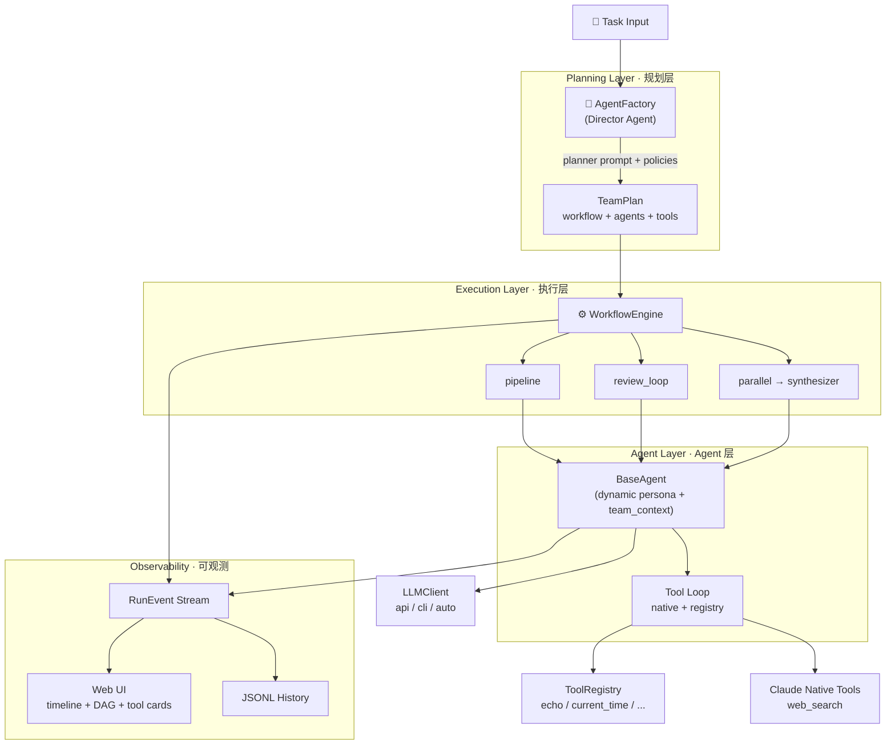

# 万象 · Wanxiang

> **AI-native multi-agent orchestration engine** — a Director dynamically plans agent teams for any task, across three workflow modes, with dual LLM backends and real-time observability.
>
> **AI 原生的多 Agent 编排引擎** —— Director 动态规划团队执行任意任务，支持三种编排模式、双 LLM 通道与实时可观测 UI。

[]()
[]()
[]()

🌐 [English](#english) | [中文](#中文)

---

## Architecture



---

## English

### Overview

**Wanxiang** (万象 — "ten thousand phenomena") is a multi-agent orchestration engine built around three core ideas:

1. **AI-native Message protocol** — agents communicate via structured messages (`intent` / `content` / `status` / `context` / `turn` / `metadata`) that LLMs can both produce and consume. No hardcoded schemas per agent.
2. **Dynamic Agent generation** — no predefined `WriterAgent` / `ReviewerAgent` subclasses. A `Director` agent reads the task and produces a `TeamPlan` at runtime: who the agents are, what their duties are, which tools they can use.
3. **Tool-aware collaboration** — every agent receives a `team_context` snapshot showing its peers' tool capabilities. Reviewers adjust their evaluation criteria based on whether the writer has live web search, which prevents unreasonable feedback in CLI-only environments.

### Features

- **Three workflow modes**: `pipeline` (sequential handoff), `review_loop` (producer + reviewer with convergence), `parallel` (concurrent researchers + synthesizer)
- **Dual LLM backend**: Anthropic Messages API (native tool use) or Claude Code CLI (stdin/stdout with JSON tool protocol). `auto` mode detects what's available and picks one.
- **Tool system**: Local `ToolRegistry` (with allowlist, timeout, schema validation) + Claude native server-side tools (e.g., `web_search`)
- **Real-time UI**: WebSocket event stream, DAG visualization with live state, tool-call sub-step cards, duration analysis, draft diff, reviewer feedback aggregation, trace replay, run history
- **Graceful degradation**: In CLI mode, native tools are auto-stripped with a warning; agents fall back to plain LLM calls rather than crashing
- **MCP status probe**: Built-in endpoint checks `claude auth status` + `claude mcp list` and surfaces the result to the UI

### Quick Start

```bash
# 1. Clone
git clone https://github.com/yeyanle6/wanxiang.git
cd wanxiang

# 2. Install dependencies (with dev extras for pytest)
pip install -e ".[dev]"

# 3. Choose an LLM backend (one of)
export ANTHROPIC_API_KEY=sk-ant-...          # API mode (full feature set)
# OR
claude auth login                              # CLI mode (no native tools)

# 4a. Run a one-shot task from the CLI
wanxiang -y "Write a 500-word blog post on multi-agent systems"

# 4b. Or launch the web UI
wanxiang-server --port 8000
# Open http://127.0.0.1:8000
```

Optional mode overrides:

```bash
wanxiang --llm-mode cli "your task"
WANXIANG_LLM_MODE=api wanxiang-server --port 8000
```

### Workflows

| Mode | When to use | Execution |
|---|---|---|
| `pipeline` | Sequential stages that transform data step by step | `agent_1 → agent_2 → ... → agent_n`, terminates on error |
| `review_loop` | Content that benefits from iterative critique | `writer → reviewer` repeats up to `max_iterations` until reviewer returns SUCCESS |
| `parallel` | Multi-perspective research, independent branches | `researcher_a ∥ researcher_b ∥ ...` run concurrently, then `synthesizer` merges outputs |

The `Director` picks the workflow. Policy layer enforces guardrails (e.g., content tasks always include a reviewer; parallel mode always has a synthesizer as the last step).

### Tool System

Two classes of tools flow through the same event interface (`tool_started` / `tool_completed`):

- **Registry tools** — Python handlers registered via `ToolRegistry.register(ToolSpec(...))`. Executed locally. Each agent's `allowed_tools` acts as an allowlist.
- **Claude native tools** — declared as `{"type": "web_search_20250305", "name": "web_search", ...}` on the agent's `native_tools`. Executed server-side by the Anthropic API. Requires API mode.

Graceful degradation: in CLI mode, native tools are stripped with a warning log; the agent continues with registry tools or plain LLM.

### Testing

```bash
pytest -q
# 53 passed
```

Coverage spans Message protocol, three workflow engines, AgentFactory policies, ToolRegistry edge cases, BaseAgent tool loop (API + CLI), RunManager event forwarding, MCP status parsing, and reviewer tool-awareness.

### Project Layout

```
.
├── wanxiang/              # Python package
│   ├── core/              # Message, BaseAgent, Factory, WorkflowEngine, Tools, LLMClient
│   ├── server/            # FastAPI app, RunManager, events, MCP probe
│   ├── cli.py             # One-shot CLI entry point
│   └── __main__.py
├── configs/agents/        # Example agent YAML configs
├── data/                  # Runtime JSONL history (gitignored)
├── tests/                 # pytest suite (53 tests)
├── wanxiang-ui.jsx        # Single-file React UI served by the FastAPI app
└── README.md
```

### Roadmap

- [x] Phase 1–3: engine, UI, event stream, MCP status probe, 53 tests
- [ ] Phase 3C: external MCP server integration (filesystem → web_search via MCP → Notion)
- [x] Packaging: `pyproject.toml` with `pip install -e ".[dev]"`
- [x] UI polish: WebSocket event loss fix, bilingual region naming (dark mode pending)
- [x] `ProjectGuide.md` — architecture evolution log

---

## 中文

### 概述

**万象**是一个多 Agent 编排引擎，建立在三个核心思想之上：

1. **AI 原生的消息协议** —— Agent 之间通过结构化消息通讯（`intent` / `content` / `status` / `context` / `turn` / `metadata`），LLM 既能生成也能消费。无需为每类 Agent 写死 schema。
2. **动态 Agent 生成** —— 没有预定义的 `WriterAgent` / `ReviewerAgent` 子类。`Director` Agent 读取任务后，在运行时生成 `TeamPlan`：团队成员是谁、各自职责、可用工具。
3. **工具感知协作** —— 每个 Agent 都会收到 `team_context` 快照，了解队友的工具能力。Reviewer 会根据 writer 是否有实时搜索来调整评审标准，避免在 CLI 环境下提出无法满足的要求。

### 特性

- **三种编排模式**：`pipeline`（顺序交接）、`review_loop`（生产者 + 评审者收敛迭代）、`parallel`（并行研究 + 合成）
- **双 LLM 通道**：Anthropic Messages API（原生 tool use）或 Claude Code CLI（stdin/stdout + JSON 工具协议）。`auto` 模式自动选择可用后端
- **工具系统**：本地 `ToolRegistry`（allowlist + 超时 + schema 校验）+ Claude 原生 server-side 工具（如 `web_search`）
- **实时 UI**：WebSocket 事件流、DAG 实时高亮、工具调用子步骤卡片、耗时分析、初稿终稿 Diff、Reviewer Feedback 聚合、trace 回放、历史记录
- **优雅降级**：CLI 模式下 native tools 自动剥离（含警告日志），Agent 回退到 registry tools 或纯 LLM，不会崩溃
- **MCP 状态探测**：内置端点检查 `claude auth status` + `claude mcp list`，结果呈现在 UI

### 快速开始

```bash
# 1. Clone
git clone https://github.com/yeyanle6/wanxiang.git
cd wanxiang

# 2. 安装依赖（dev 附加依赖用于 pytest）
pip install -e ".[dev]"

# 3. 选择一个 LLM 后端（二选一）
export ANTHROPIC_API_KEY=sk-ant-...          # API 模式（完整能力）
# 或
claude auth login                              # CLI 模式（无 native tools）

# 4a. 从 CLI 一次性跑一个任务
wanxiang -y "写一篇关于多 Agent 系统的 500 字博客"

# 4b. 或启动 Web UI
wanxiang-server --port 8000
# 浏览器打开 http://127.0.0.1:8000
```

可选的模式覆盖：

```bash
wanxiang --llm-mode cli "你的任务"
WANXIANG_LLM_MODE=api wanxiang-server --port 8000
```

### 工作流模式

| 模式 | 适用场景 | 执行逻辑 |
|---|---|---|
| `pipeline` | 顺序阶段逐步变换数据 | `agent_1 → agent_2 → ... → agent_n`，遇错中止 |
| `review_loop` | 内容类任务需要反复打磨 | `writer → reviewer` 最多重复 `max_iterations` 轮直到 SUCCESS |
| `parallel` | 多角度研究、独立分支 | `researcher_a ∥ researcher_b ∥ ...` 并发执行，最后 `synthesizer` 合并 |

`Director` 负责选择工作流。策略层会兜底（内容类任务必有 reviewer；parallel 模式末位必为 synthesizer）。

### 工具系统

两类工具走同一套事件接口（`tool_started` / `tool_completed`）：

- **Registry 工具** —— Python handler 通过 `ToolRegistry.register(ToolSpec(...))` 注册，本地执行。每个 Agent 的 `allowed_tools` 作为 allowlist。
- **Claude 原生工具** —— 以 `{"type": "web_search_20250305", "name": "web_search", ...}` 形式声明在 agent 的 `native_tools`，由 Anthropic API 服务端执行。需 API 模式。

CLI 模式下 native tools 会被自动剥离并记录警告日志，Agent 自动回退到 registry tools 或纯 LLM 调用。

### 测试

```bash
pytest -q
# 53 passed
```

覆盖范围：Message 协议、三种编排引擎、AgentFactory 策略、ToolRegistry 边界、BaseAgent tool loop（API + CLI）、RunManager 事件转发、MCP 状态解析、Reviewer 工具感知。

### 项目结构

```
.
├── wanxiang/              # Python 包
│   ├── core/              # Message、BaseAgent、Factory、WorkflowEngine、Tools、LLMClient
│   ├── server/            # FastAPI app、RunManager、事件、MCP 探测
│   ├── cli.py             # 一次性 CLI 入口
│   └── __main__.py
├── configs/agents/        # 示例 agent YAML 配置
├── data/                  # 运行时 JSONL 历史（已 gitignore）
├── tests/                 # pytest 测试（53 个）
├── wanxiang-ui.jsx        # FastAPI 提供的单文件 React UI
└── README.md
```

### 路线图

- [x] Phase 1–3：引擎、UI、事件流、MCP 状态探测，53 个测试
- [ ] Phase 3C：接入真实外部 MCP server（filesystem → MCP web_search → Notion）
- [x] 打包：`pyproject.toml` + `pip install -e ".[dev]"`
- [x] UI 润色：WebSocket 事件丢失修复、区域命名中英化（深色模式待做）
- [x] `ProjectGuide.md` —— 架构演进记录

---

## License

MIT (pending LICENSE file)
